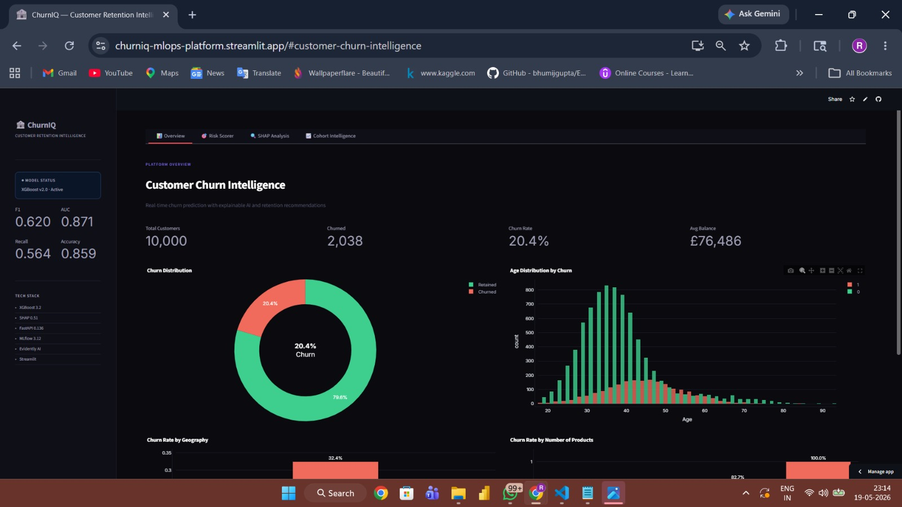
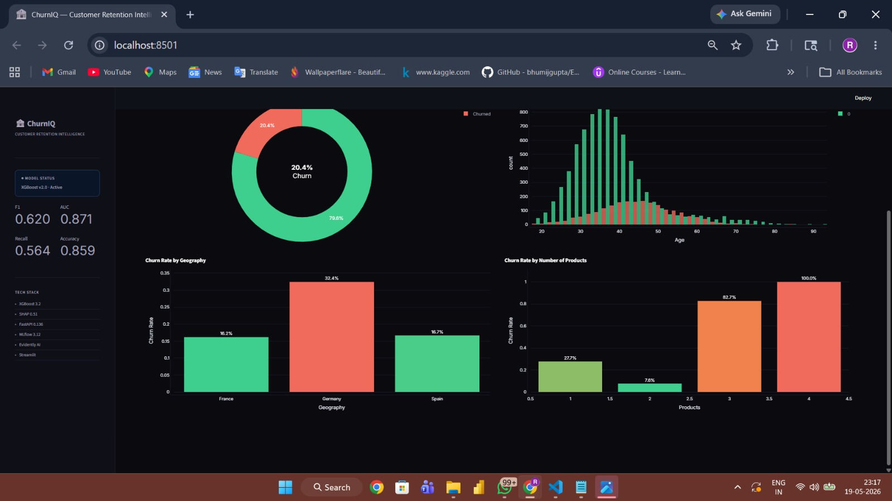

# 🏦 ChurnIQ — Customer Retention Intelligence Platform

[](https://python.org)
[](https://xgboost.ai)
[](https://fastapi.tiangolo.com)
[](https://mlflow.org)
[](https://streamlit.io)
[](https://shap.readthedocs.io)
[](LICENSE)

> An end-to-end AI-powered customer churn intelligence platform that predicts churn probability, explains customer behavior using SHAP, and provides business-focused retention insights through an interactive analytics dashboard.

---

# 🚀 Live Application

### 🔗 Streamlit Deployment

https://churniq-mlops-platform.streamlit.app/

---

# 📸 Dashboard Preview

## 📊 Overview Dashboard





---

## 🎯 Risk Scorer


---

## 🔍 SHAP Explainability


---

## 📈 Cohort Intelligence


---

# 🎯 Business Problem

Customer churn is one of the largest revenue risks for banks and financial institutions. Acquiring a new customer is significantly more expensive than retaining an existing one.

Banks need systems that can:

- Predict which customers are likely to churn
- Explain why customers are at risk
- Identify high-risk customer segments
- Support data-driven retention strategies

ChurnIQ combines machine learning, explainable AI, and interactive analytics into a single end-to-end intelligence platform.

---

# ✨ Key Features

- Real-time customer churn prediction
- Explainable AI using SHAP
- Interactive Streamlit dashboard
- Cohort intelligence analytics
- Business-oriented retention insights
- MLflow experiment tracking
- End-to-end ML pipeline
- FastAPI inference service
- Production-style dark UI
- Feature engineering pipeline
- Data drift monitoring using Evidently AI

---

# 🧠 Tech Stack

| Layer | Technology |
|---|---|
| ML Model | XGBoost |
| Explainability | SHAP |
| Pipeline | Scikit-learn Pipeline |
| Imbalance Handling | SMOTE |
| Experiment Tracking | MLflow |
| API | FastAPI |
| Dashboard | Streamlit + Plotly |
| Monitoring | Evidently AI |
| Testing | Pytest |
| Version Control | Git + GitHub |

---

# 📊 Model Performance

| Metric | Score |
|---|---|
| Accuracy | 86.0% |
| ROC-AUC | 0.871 |
| F1 Score | 0.620 |
| Recall | Optimized for churn detection |

> Dataset: 10,000 banking customers  
> Churn Rate: 20.4%

---

# 🔧 Feature Engineering

Custom engineered features built into the ML pipeline:

| Feature | Purpose |
|---|---|
| `balance_salary_ratio` | Financial stability indicator |
| `products_per_tenure` | Customer engagement measurement |
| `age_bucket` | Age-based churn segmentation |
| `is_zero_balance` | Strong churn-risk indicator |
| `engagement_score` | Composite loyalty score |
| `npa_risk_flag` | Potential inactive-risk signal |

---

# 🏗️ System Architecture

```text
Raw Banking Data
        ↓
Feature Engineering
        ↓
Preprocessing Pipeline
        ↓
SMOTE + XGBoost Model
        ↓
MLflow Experiment Tracking
        ↓
FastAPI Prediction Layer
        ↓
Streamlit Analytics Dashboard
```

---

# 📂 Project Structure

```bash
ChurnIQ/
├── src/
│   ├── train.py
│   ├── serve.py
│   ├── streamlit_app.py
│   ├── feature_engineering.py
│   ├── explain.py
│   ├── monitor.py
│   └── pipeline.py
│
├── models/
├── data/
├── assets/
├── tests/
├── requirements.txt
└── README.md
```

---

# ⚙️ Run Locally

```bash
# Clone repository
git clone https://github.com/rashmisontakke/churniq-mlops-platform.git

# Create virtual environment
python -m venv venv

# Activate environment
venv\Scripts\activate

# Install dependencies
pip install -r requirements.txt

# Run application
streamlit run src/streamlit_app.py
```

---

# 📡 API Endpoints

| Endpoint | Description |
|---|---|
| `/predict` | Predict churn probability |
| `/predict/batch` | Batch predictions |
| `/health` | API health monitoring |
| `/metrics` | Model performance metrics |

---

# 📈 Monitoring

Evidently AI is used for:

- Data drift monitoring
- Feature stability analysis
- Churn trend tracking
- Model behavior validation

---

# 🚢 Deployment

The application is deployed on Streamlit Community Cloud and integrated with GitHub for continuous updates.

---

# 👩‍💻 Author

**Rashmi Sontakke**

🔗 GitHub: https://github.com/rashmisontakke